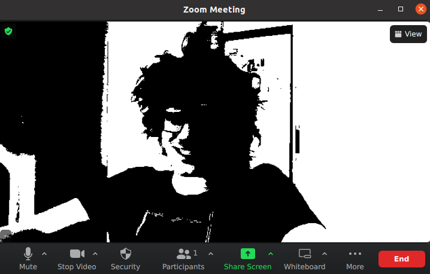

# V4L OpenGL Filter
A simple application of the OpenGL shader to the Linux video device (webcamera)

## Quick Start
1. Install [v4l2loopback](https://wiki.archlinux.org/title/V4l2loopback) - the Linux kernel module for creation virtual webcamera devices

2. Create virtual device:
```bash
sudo modprobe v4l2loopback
```

3. Build and run the applicatoin:
```bash
cargo build --release && ./target/release/v4l_gl_filter /dev/video0 /dev/video2
```
In your case the device ids (`video0`, `video2`) may differ. Select the appropriate ones (the first device is your main camera, the second one is your virtual camera, created by v4l2loopback module)

4. Now you can select the virtual camera in any streaming application (e.g Zoom)
    


## Custom shader
You can implement your custom fragment shader which will be applied to each video frame. [filter.frag](./shaders/filter.frag) provides the default implementation. Modify it as you need and rebuild the apllication.
